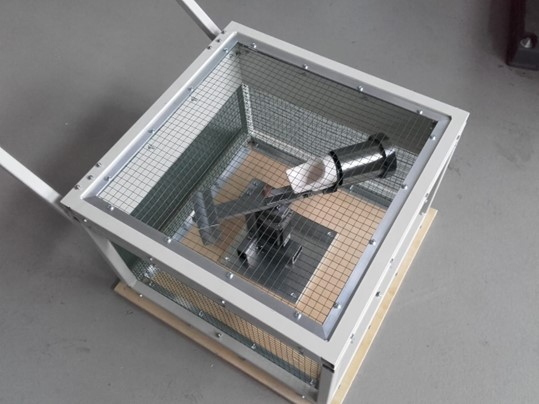

<h1 style=align="center">Centrifugal Casting Machine</h1>

<i>Open Source Motor Driven Casting Machine With Adjustable Balance Weight</i>

 
 
This is a casting machine for investment casting small parts from soft metals. I designed and built it in 2021 for a university lab as my bachelor's thesis project. All documentation for the machine, as well as the casting procedure and SOP documents, can be found in the REPORT pdf, and all of the parts and assemblies are in the CAD zip file (Solidworks). This casting machine is released under the Creative Commons Zero v1.0 Universal open source license. 

											
Machine Specifications
--
- Construction: Bolted extruded and plate steel (S235) 
- Enclosure: Welded steel and chicken wire
- Motor: 36 V Nema 23 with GP56–S1–7–SR – High-Torque Planetary Gearbox
- Motor Controller: Infineon Technologies motor control shield with IFX007T
- Power Supply: HJS Adjustable AC 110/220V to DC 0-24/36/48V 480W
- Output: Up to 428 RPM at 12.1 Nm torque
- Speed: Full rotation speed in 0.7 rotations (~0.4 seconds)
- Casting Temperature: Up to 1080°C
- Materials: Soft metals
- Material Density Range: Aluminum (2560 kg/m3) - fine gold (19320 kg/m3)
- Resolution: Up to 25 𝜇𝑚
- Articulated arm means forces are always aligned in the right direction
- Used safely by college students in a fabrication lab
- Fits standard COTS components used for centrifugal casting
  - Casting Crucible: Neycraft Standard
    - Weight: 266.5 g
    - Capacity: 13.2 ml (9 Oz gold or 5 Oz silver)
  - Investment Flasks
    - Stainless steel, solid wall flasks
    - (2” – 4” diameters, in 1.2” increments)
    - 76.2 mm (b) • 76.2 mm (h) • 1.63 mm (t)
    - 50.8 mm (b) • 63.5 mm (h) • 1.63 mm (t)

Author
--
Project Lead, Machine Design and Fabrication:
 
Aaron Hinkle
 
 
Technical Help:
 
Veda Vyas
 
Leen Nijim
 
Prof. Dr. William Megill
 
 
Rhine-Waal University of Applied Sciences
 
https://www.hochschule-rhein-waal.de/en

License
--

This machine and all the work in this repository is released under the following open source license:

Creative Commons Zero v1.0 Universal, CC 1.0 Universal